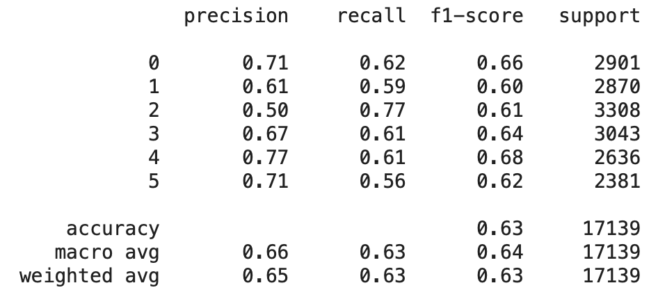

# Progress Update 

## First Quarter Recap

During the first quarter of our project we received the open-source Google Taskmaster-1 dataset, which consists of dialogs created between a customer and an agent having a conversation recorded in text about one of the following six topics: ordering pizza, creating auto repair appointments, setting up ride service, ordering movie tickets, ordering coffee drinks, and making restaurant reservations.

Using this dataset we began to explore possibilities for our project, and eventually settled on the idea of building a customer service helper.
Our idea was to run predictions on the content of a customer service interaction and provide the assistant with helpful links and information. Part of our group focused on buliding the chat app, and while this was going on the rest of the group explored different options for modelling. Eventually, we settled on using a BERT based classification model, and now we are working on building an initial product to test our concept.

## Update

### Overview

We have continued to make extensive progress toward creating a fully functioning product for Invoca’s employees to use and test. These past couple of weeks we have used several popular frameworks such as: React, Flask, MongoDB, Docker, Socket.io, and Node.js to combine the different parts of our project. 

First off,our team has a very diverse background and to make it easier for all team members to work in the same environment without having to deal with the issues of working on different systems each with their own unique system specifications we decided to employ docker. The reason for using docker is it creates a self-contained development environment that adapts to any users system specifications. The isolation and the portability allows our team members to quickly start working on our app and share the containers using docker hub. Additionally, this would greatly speed up development and allow for more detailed testing and debugging. 

Using NodeJS and Socket.io web socket library on the back end I was able to create a real time chat application that Inovca’s employees can directly interact with.  The idea is that the customer support agent and customer will both be using this application to communicate doubts and concerns in real time. After the conversation has terminated this chat log will be forwarded to our predictive models. For these chat logs to be transferred they have to be stored in a safe and secure database.The database we will be utilizing is MongoDB which is an extremely fast NoSQL database meaning it uses JSON-like documents. The chat log from this database will be fed into our prediction loop where we take the raw text as input and output our predictions.

To deploy our machine learning models we will be utilizing Flask which is a micro web framework written in python that will be used to connect to our database using MongoEngine. Flask will play the critical role of interacting with both the frontend network to relay the predictions of our machine learning models to React and the backend to route the conversations from the database into our models.

The next couple of weeks our team will work largely on testing to make sure data is being properly transferred between the different pipelines. We also wish to have an initial version to demo and test by Invoca’s employees, so we can see how accurate our predictive model is. 

### Model details

We have used BERT through the Simple Transformers API to train our classification model. Simple Transformers is an API that provides an easy way to train task-specific transformer based models for more downstream use. The API supports several pretrained transformer models and six common tasks. Since we wanted to use BERT for classification, this API provided us with a very simple way to train and inspect our models.
After tokenizing, removing stopwords, and doing some more simple pre-processing, we trained a classification model using entire conversations as inputs, and our 6 labels as outputs. The resulting model performs very well, with the results broken down below:

The output categories above correspond, respectively, to restaurant-reservations, movie-tickets, pizza, coffee, auto-repair, uber. This model was trained using entire conversations as inputs, but we anticipate that it will be useful to be able to make predictions before the conversation is over. So, we repeated the same training process as above but using a dataset where we linked each line from every conversation to the conversation’s label, to make the model classify individual lines. We got the following results:

As expected, the results are not as good as predictions that run on the entire conversation, but they are still surprisingly accurate considering the fact that a substantial amount of individual lines are unlikely to carry unambiguous features for classification. This leads us to conclude that this model is good enough to use for our initial prototype, and we need to first run initial versions of our entire project to see whether (and where) improvement might be necessary. So, for now we have developed a prediction script that loads this model and is ready (pending some debugging) to be deployed in our Flask app for testing.
